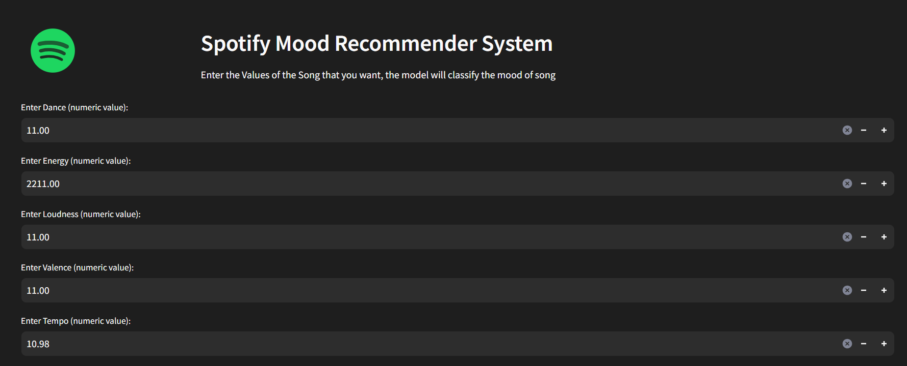
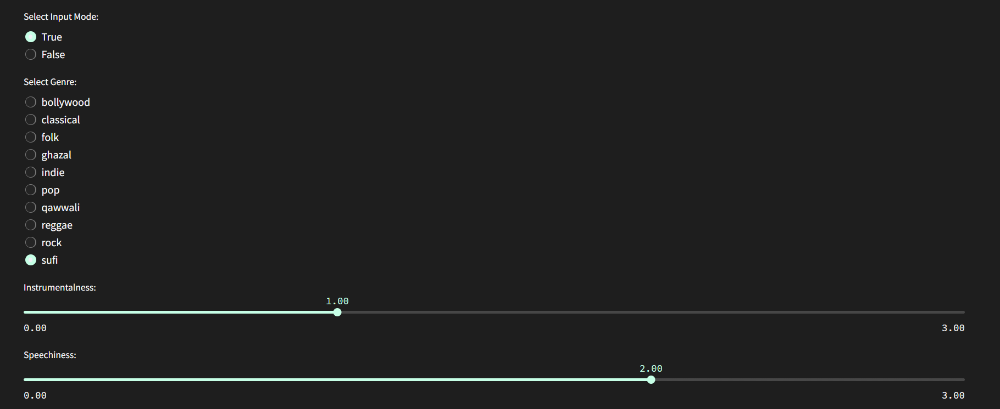
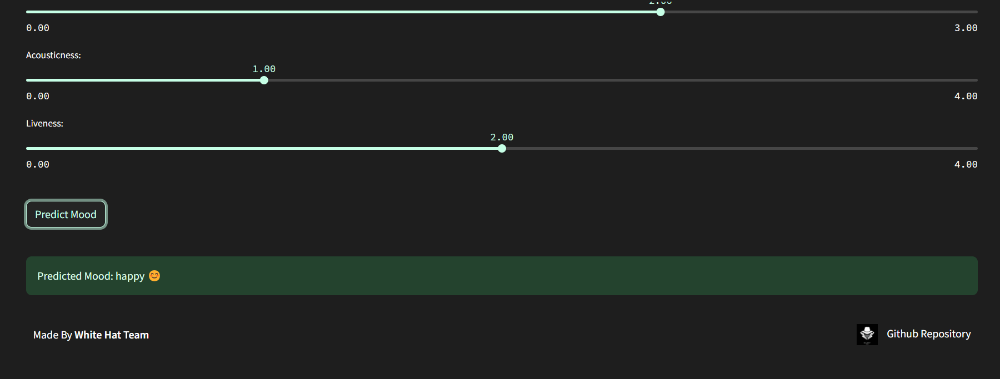

# 🎧 MUSIC MOOD PREDICTOR

The Music Mood Predictor utilizes a Random Forest algorithm to provide personalized music recommendations based on user-input audio features. With its user-friendly Streamlit interface, the application offers an interactive experience, allowing users to explore mood-specific song suggestions seamlessly. Continuous improvement is ensured through a feedback loop, adapting the model to better cater to individual preferences over time.

## Preview






## Working of the Project

The **Music Mood Predictor** is an interactive system designed to recommend music based on the user's mood. Unlike traditional recommendation systems, our approach allows users to input specific audio features of a song, enabling a personalized and precise mood prediction.

### Data Collection and Preprocessing

1. **Dataset:** We gathered a diverse dataset of music tracks, each labeled with corresponding mood categories (e.g., happy, sad, energetic).

2. **Features Extraction:** Extracted relevant audio features from the dataset, including tempo, key, valence, danceability, and acousticness, to capture the musical characteristics associated with different moods.

### Machine Learning Model

3. **Model Training:** Utilized a Random Forest machine learning model to predict the mood of a given music track based on its audio features.

4. **User Input:** Unlike traditional systems, our model accepts user input for specific audio features, allowing for a personalized mood prediction experience.

### User Interaction

5. **Streamlit Interface:** Developed a user-friendly interface using Streamlit, enabling users to input the audio features of a song or select from predefined moods.

6. **Mood Prediction:** The application processes user-input audio features and uses the Random Forest model to predict the mood of the provided song.

### Visualizations

7. **Output Display:** Visualized the predicted mood along with relevant information such as artist, song title, and mood tags.

8. **Interactive UI:** Designed an interactive user interface that allows users to input audio features, receive mood predictions, and explore recommended tracks directly within the application.

### Continuous Learning

9. **Feedback Loop:** Incorporated user feedback mechanisms to continuously improve the Random Forest model, enhancing the accuracy of mood predictions for a more personalized experience.

This project aims to revolutionize music recommendations by providing users with the ability to input specific audio features, ensuring a tailored and accurate mood prediction for each song.

Feel free to explore and discover music that resonates with your emotions!


## How to Run the Project

Follow these steps to set up and run the project locally:

1. **Fork the Repository:**
   Clone or fork this repository to your local machine.

    ```bash
    git clone https://github.com/your-username/Music-Mood-Predictor.git
    ```

2. **Install Dependencies:**
   Install Python 3.10 and all additional dependencies listed in the requirements.txt file.

    ```bash
    pip install -r ./requirements.txt
    ```

3. **Run the Jupyter Notebook:**
   Open a terminal and run the Jupyter notebook.

    ```bash
    python -m jupyterlab
    ```

4. **Run the Streamlit App:**
   Open another terminal and run the Streamlit app.

    ```bash
    streamlit run app.py
    ```
  The Streamlit app will be hosted on `localhost:8501`


## Contribute:

We welcome contributions from the developer community to enhance and refine the Music mood predictor app. Feel free to fork the repository, submit issues, and create pull requests to make this project even more robust and feature-rich.<b>🎬✨</b>

## Check this out

Explore the live version of the Music Mood Recommender System on [this URL](https://spotifysystem.azurewebsites.net/)
